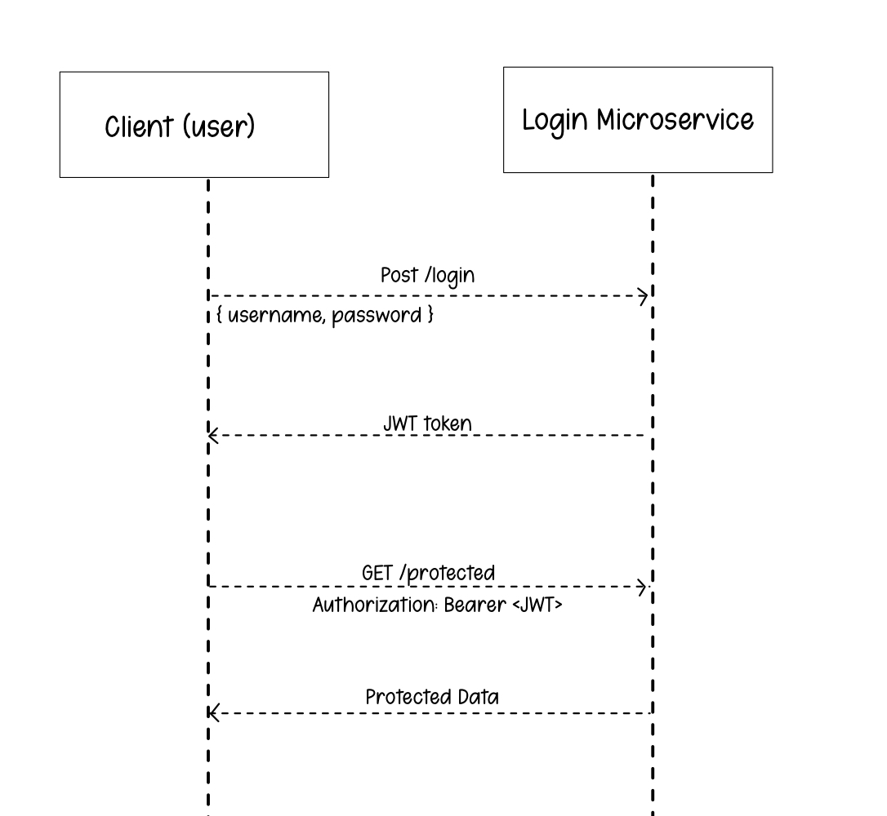

# README Login Microservice

The Login Microservice allows the user/client to authenticate a user by sendin a POST request with a username and password. If all the informartion is correct then the service will respond with a JWT token that will be used to authenticate the request. Otherwise, if the information is wrong, then the service will return an error message.

# Request and Receive Data 

POST - /login: This used to authenticate a user and receive the JWT token.
     * Resquest Body:
        - username
        - password
     * Reponse: 
        - 200 (OK): returns JWT token when it's sucessful
        - 400 (Error): returns error messages if information is wrong

GET - /protected: This is a protected raoute that requires the JWT token to be able to acess.
     * Request header:
        - Authorization
     * Response:
        - 200 (OK): returns procted data and user information if the token is valid
        - 400 (Unauthorized): returns error messages if invalid or missing token

To request data from the microservice, there's needs to be a POST request to the "/login" endpoint with the user's information. 

Example: Requesting a JWT token

var axios = require("axios")

axios.post("http://localhost:4001/login", {
    username: "user1",
    password: "WelcomeUser!"
})
.then(({ data }) => console.log("Token:", data.token))
.catch(({ response }) => console.log("Error:", response?.data))

Receiving data happens once the login is successful and there's a JWT token, it can be used to acess the protected data by sending a GET request to "/protected" endpoint with the "Authorization" header that has the JWT token.

Example: Accessing procted data

axios.get("http://localhost:4001/protected", {
    headers: { Authorization: "Bearer YOUR_JWT_TOKEN" }
})
.then(({ data }) => console.log("Data:", data))
.catch(({ response }) => console.log("Error:", response?.data))

# UML Sequence Diagram

